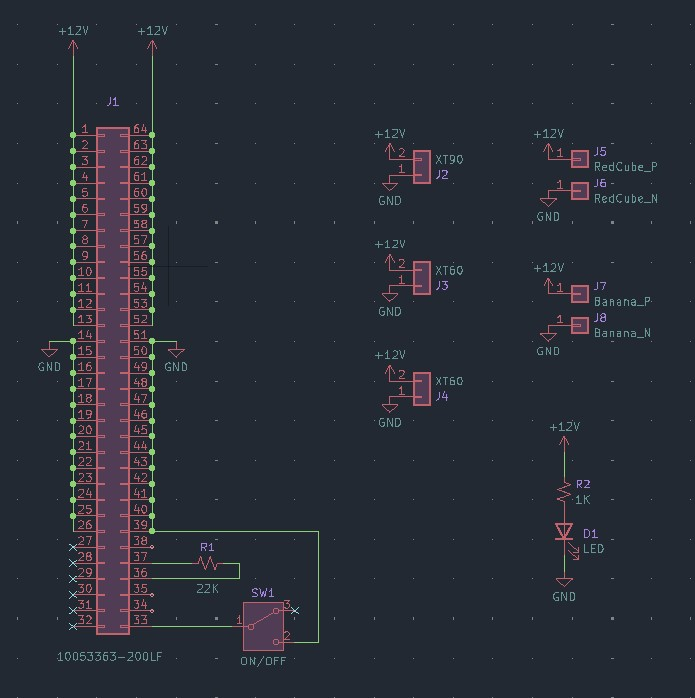

## CommonSlotAdapter

Adapt HP server power supplies to common high power connectors rather than typical multiple PCI-E connectors.

- Card edge connector: 
    - Amphenol FCI 10053363-200LF [Digikey](https://www.digikey.com/en/products/detail/amphenol-cs-fci/10053363-200LF/1493359?s=N4IgTCBcDaIIwAYEFYDMqBsqC0YkBkAxEAXQF8g)
- Banana jacks: 
    - Cinch 105-0752-001 [Digikey-Red](https://www.digikey.com/en/products/detail/cinch-connectivity-solutions-johnson/105-0752-001/5887) / [Digikey-Black](https://www.digikey.com/en/products/detail/cinch-connectivity-solutions-johnson/105-0753-001/5888) 
- Switch: 
    - Nidec ATE1D-2M3-10-Z [Digikey](https://www.digikey.com/en/products/detail/nidec-components-corporation/ate1d-2m3-10-z/1792018)

