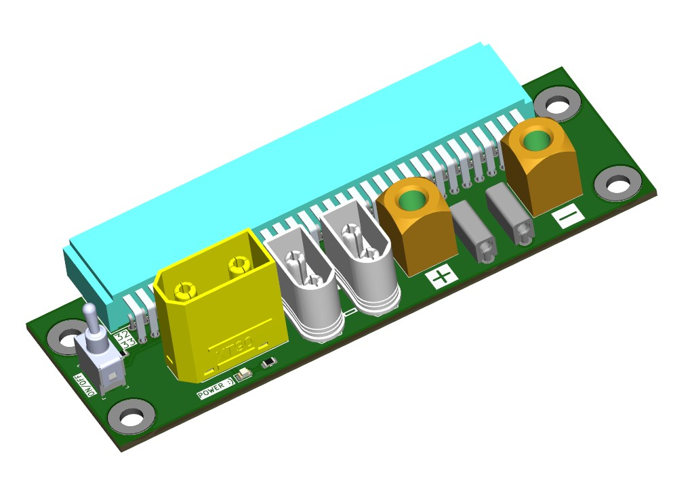

## CommonSlotAdapter

Adapt HP server power supplies to common high power connectors rather than typical multiple PCI-E connectors.

Based on Rob Ruark's [Common Slot Breakout](http://robruark.com/projects/common_slot/common_slot.html), see local copy of his files here in this repo under [CommonSlot_RobRuark](https://github.com/corygrant/CommonSlotAdapter/tree/main/CommonSlot_RobRuark) for reference.

- Card edge connector: 
    - Amphenol FCI 10053363-200LF [Digikey](https://www.digikey.com/en/products/detail/amphenol-cs-fci/10053363-200LF/1493359?s=N4IgTCBcDaIIwAYEFYDMqBsqC0YkBkAxEAXQF8g)
- Banana jacks: 105-0752-001 [Digikey-Red](https://www.digikey.com/en/products/detail/cinch-connectivity-solutions-johnson/105-0752-001/5887) / [Digikey-Black](https://www.digikey.com/en/products/detail/cinch-connectivity-solutions-johnson/105-0753-001/5888) 
- Switch: ATE1D-2M3-10-Z [Digikey](https://www.digikey.com/en/products/detail/nidec-components-corporation/ate1d-2m3-10-z/1792018)

Note: 1K resistor connected between pin 33 and 36 to turn the output on. 

